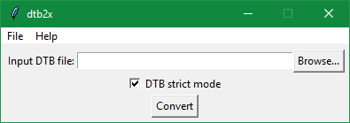

# dtb2x
Simple and easy to use DTB to XLSX (and CSV) format converter.

*The graphical user interface of the dtb2xgui converter.*

# Installation

On Windows, run `install.bat` or install requirements from `requirements.txt` using `pip`.

# Run

Double click `dtb2xgui.pyw` or you can also run `python dtb2xgui.pyw` from the command line.

## Conversion process

Input DTB format defines a hierarchy of sports groups, teams, and players. Each team is indented with a single tab `\t`,
and each player is indented with two tabs `\t\t`.

A group contains teams, it is a top-level record in DTB file. A team belongs to a single group and contains players.
Each player belongs to a single team. Please see `dtb2x.core.DtbReader` for a specification of individual fields.

Example files are in `example` directory.

~~~
group_name - group_note
	team_name - team_note
		00001234 - player_surname player_name, 01.01.1900 , player_note
~~~
*Listing: Example input DTB file.*

~~~
Název, Oddíl;Poznámka, Oddíl;Název, Družstvo;Poznámka, Družstvo;Reg. číslo, Hráč;Jméno, Hráč;Příjmení, Hráč;Datum nar., Hráč;Poznámka, Hráč
group_name;group_note
group_name;group_note;team_name;team_note
group_name;group_note;team_name;team_note;00001234;player_name;player_surname;01.01.1900;player_note
~~~
*Listing: Corresponding CSV file, including table header in Czech.*

*Table: Corresponding XLSX table, including table header in Czech.*

| Název, Oddíl | Poznámka, Oddíl | Název, Družstvo | Poznámka, Družstvo | Reg. číslo, Hráč | Jméno, Hráč | Příjmení, Hráč | Datum nar., Hráč | Poznámka, Hráč |
|--------------|-----------------|-----------------|--------------------|------------------|-------------|----------------|------------------|----------------|
|group_name|group_note|							
|group_name|group_note|team_name|team_note|					
|group_name|group_note|team_name|team_note|00001234|player_name|player_surname|01.01.1900|player_note|

## Strict mode
Convert DTB files to CSV using strict mode for reading DTB file and validation of its format. When strict mode is
enabled, trying to convert DTB file containing format mistakes raises exceptions. If strict mode is disabled,
the reader tries to tolerate small formatting mistakes like missing spaces and missing commas.

## Useful links
- https://www.python-course.eu/python_tkinter.php
- http://effbot.org/tkinterbook/
